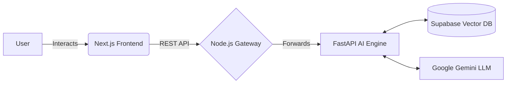

# Loop Institute - Frontend Client 🚀


> The modern, responsive user interface for the Loop Institute of Coaching AI Customer Service platform.

## 📌 Overview
This repository contains the frontend application built with Next.js. It serves as the primary interface for users to interact with "Loopy", our intelligent AI Coaching Assistant. The application communicates with the Node.js API Gateway to ensure secure and efficient data routing.

## 🏗 System Architecture


## 🚀 Getting Started

### Prerequisites
- Node.js (v18 or higher)
- npm or yarn

### Installation
1. Clone the repository:
   ```bash
   git clone https://github.com/yourusername/loop-client.git
   cd loop-client
   ```
2. Install dependencies:
   ```bash
   npm install
   ```
3. Create a `.env.local` file in the root directory and add the Gateway URL:
   ```env
   NEXT_PUBLIC_API_URL=http://localhost:3000/api
   ```
4. Start the development server:
   ```bash
   npm run dev
   ```
5. Open [http://localhost:3000](http://localhost:3000) with your browser to see the result.

## 📂 Project Structure
- `/components`: Reusable UI components (Chatbox, Buttons, etc.)
- `/pages` or `/app`: Next.js routing and views
- `/styles`: Global styles and Tailwind configuration
- `/public`: Static assets (images, icons)

---
## 👨‍💻 Author
**Ahmad Fadilah**
* [LinkedIn Profile](https://www.linkedin.com/in/ahmadfadilah-fadil)